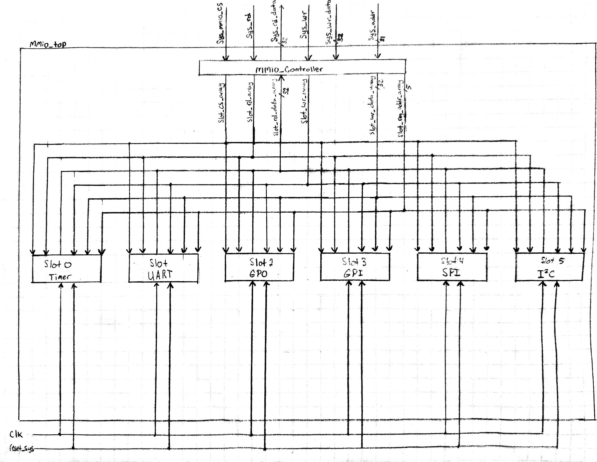
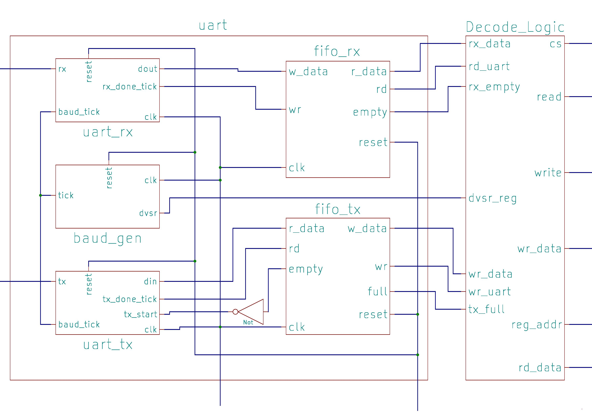
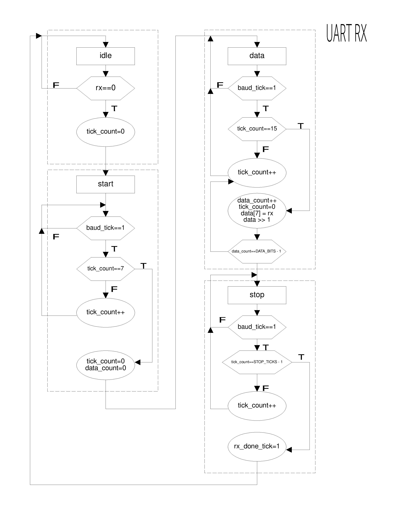
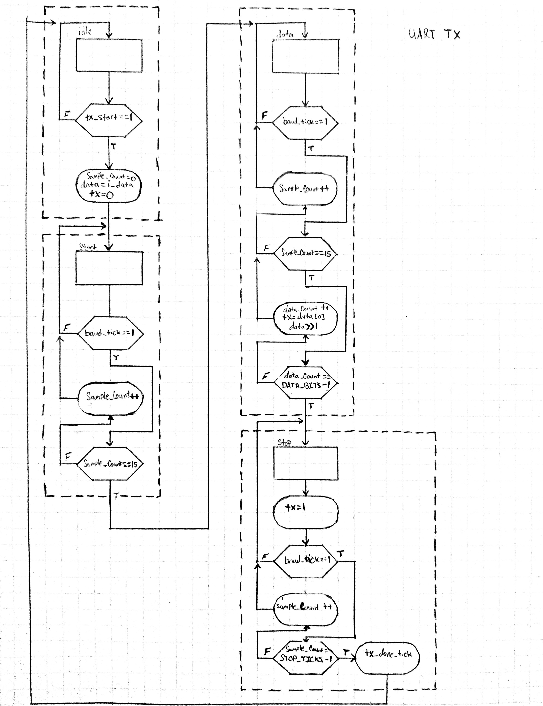
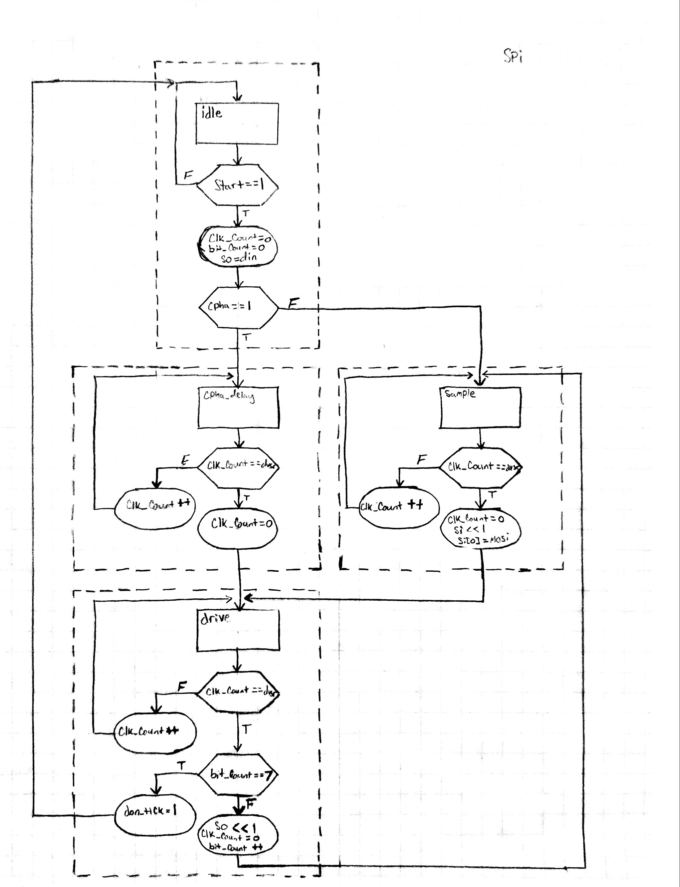
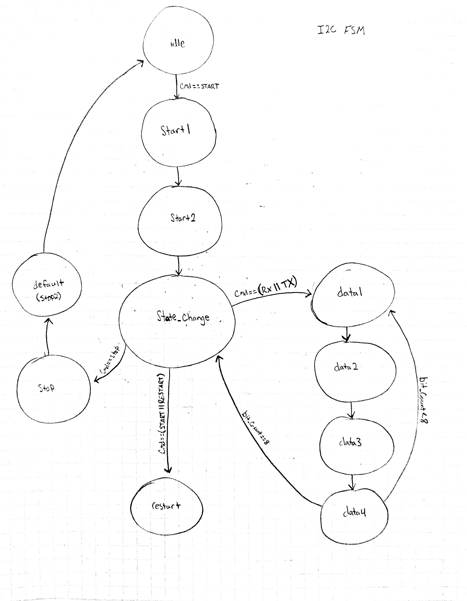
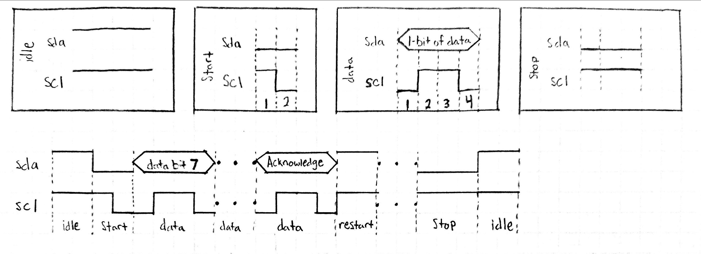

# Serial-Communication-SoC
- SoC using the Microblaze MCS designed for using different serial communication methods. The SoC contains a UART core, a SPI core, and an I2C core
- The SoC has 64 slots available for cores
- Each core contains 32 32-bit registers

Table of Contents
=================

   * [Directory Structure](#directory-structure)
   * [Hardware](#hardware)
      * [MMIO](#mmio)
         * [Timer Core](#timer-core)
         * [GPI Core](#gpi-core)
         * [GPO Core](#gpo-core)
         * [UART](#uart)
         * [SPI Core](#spi-core)
         * [I2C Core](#i2c-core)
   * [Software](#software)
      * [System Files](#system-files)
      * [Drivers](#drivers)
         * [GPIO](#gpio)
         * [UART](#uart-1)
         * [SPI](#spi)
         * [I2C](#i2c)
      * [Applications](#applications)

# Directory Structure
<pre>
├── Diagrams
│   ├── i2c_fsm.jpg
│   ├── i2c_timing.jpg
│   ├── mmio.jpg
│   ├── soc_top.jpg
│   ├── spi.jpg
│   ├── uart.jpg
│   ├── uart_rx.jpg
│   └── uart_tx.jpg
├── Hardware
│   ├── MMIO
│   │   ├── Cores
│   │   │   ├── GPIO
│   │   │   │   ├── gpi.sv
│   │   │   │   └── gpo.sv
│   │   │   ├── I2C
│   │   │   │   ├── i2c_core.sv
│   │   │   │   └── i2c_master.sv
│   │   │   ├── SPI
│   │   │   │   ├── spi_core.sv
│   │   │   │   └── spi.sv
│   │   │   ├── Timer
│   │   │   │   └── timer.sv
│   │   │   └── UART
│   │   │       ├── baud_gen.sv
│   │   │       ├── FIFO
│   │   │       │   ├── fifo_ctrl.sv
│   │   │       │   ├── fifo.sv
│   │   │       │   └── reg_file.sv
│   │   │       ├── uart_core.sv
│   │   │       ├── uart_rx.sv
│   │   │       ├── uart.sv
│   │   │       └── uart_tx.sv
│   │   ├── mmio_controller.sv
│   │   └── mmio_top.sv
│   └── System
│       ├── io_map.svh
│       ├── soc_top.sv
│       └── sys_bridge.sv
├── README.md
└── Software
    ├── Applications
    │   └── main.cpp
    ├── Drivers
    │   ├── GPIO
    │   │   ├── gpio_core.cpp
    │   │   └── gpio_core.h
    │   ├── I2C
    │   │   ├── i2c_core.cpp
    │   │   └── i2c_core.h
    │   ├── SPI
    │   │   ├── spi_core.cpp
    │   │   └── spi_core.h
    │   ├── TIMER
    │   │   ├── timer_core.cpp
    │   │   └── timer_core.h
    │   └── UART
    │       ├── uart_core.cpp
    │       └── uart_core.h
    └── SystemFiles
        ├── init.cpp
        ├── init.h
        ├── io_map.h
        └── io_rw.h

</pre>

# Hardware

- The soc_top.sv file instantiates and connects the Microblaze MCS, the system bridge, and the MMIO unit
- The sys_bridge.sv file handles the communication between the Microblaze MCS and the MMIO unit
    - The Microblaze MCS sends a 32-bit address to the system bridge. Bits 24-31 are used to determine if the address contains correct bridge base address. Bit 23 is used as the chip select signal for the MMIO subsystem (it should be 0). Bits 2-22 are used as the 21-bit address sent to the MMIO system. 
    - The read and write signals, as well as the read and write data, are passed directly through the bridge
- The io_map.svh file contains the mapping for the slots in the MMIO system.

## MMIO

- The memory mapped I/O system (MMIO) contains all the cores as well as a controller 
- The register address is contained in bits 0 to 4
- The slot address is contained in bits 5 to 10
- MMIO Controller
    - The MMIO controller handles the communication between the system bus and the MMIO cores. 
    - The controller takes the 21-bit address from the system bus and decodes it into the slot address and the register address.

### Timer Core
- A core for controlling timing
- Register Map:
	- offset 0 (Read register):
		-  bits[31:0]: lower word of counter
	- offset 1 (Read register): 
		- bits[15:0]: 16 MSBs of counter 
	- offset 2 (Write register): 
		- bit 0: go signal
		- bit 1: clear signal

### GPI Core
- A general purpose input that receives the input from the switches on the FPGA

### GPO Core
- A general purpose output that transmits data to the leds on the FPGA

### UART

- Register Map:
	- offset 0 (Read register):
		- bits[7:0]: read data (received bits)
		- bit 8: empty signal from fifo_rx
		- bit 9: full signal from fifo_tx
	- offset 1 (Write register):
		- bits[10:0]: Divisor value
	- offset 2 (Write register):
		- bits[7:0]: write data (bits to be transmitted)

### SPI Core

- Register Map:
	- offset 0 (Read register):
		- bits[7:0]: Received data byte
		- bit[8]: ready signal from controller
	- offset 1 (Write register):
		- bits[S-1:0]: Slave select signal
	- offset 2 (Write register):
		- bits[15:0] divisor value
		- bit[16]: cpol
		- bit[17]: cpha
	- offset 3 (Write register):
		- bits[7:0]: Transmit data

### I2C Core

- Register Map:
    - Offset 0 (Read Register):
        - bit[0]: rx acknowledge bit
        - bits[8:1]: rx data
		- bit[9]: ready signal
    - offset 1 (Write register):
		- bits[15:0]: divisor
	- offset 2 (Write register):
		- bit[7:0]: tx_data
		- bits[10:8]: command

# Software
- Each core has a driver written in C++. The header file contains the register map, the method prototypes, and masks (when necessary)
- The .cpp files contain the methods for each driver

## System Files
- init.h instantiates the timer and uart cores. In addition, init.h contains the prototypes for timing control methods and debug methods. Finally, it includes bit manipulation macros
- init.cpp contains the full code for the timing and debug methods
- io_map.h contains definitions for the system clock frequency as well as the bridge base address. The slot positions are also defined in io_map.h
- io_rw.h contains macros for reading data, writing data, and retrieving the base slot address of any given core.
## Drivers
### GPIO
- The drivers for both the gpo and gpi cores are contained in the same files (gpio.h and gpio.cpp)
- The gpo core allows for writing one word or one bit
- The gpi core allows for reading one word or one bit

### UART
- Contains methods for setting baud rate, getting the status of the FIFO buffers, transmitting and receiving bytes, and display methods

### SPI
- Contains methods for setting the frequency, writing the slave select signal, setting the mode, writing to the control register (which contains the phase, polarity, and divisor), and a method for initiating the transfer

### I2C
- Contains methods for setting the frequency, setting the state (start, restart, stop), getting the ready status, and methods for transmitting and receiving bytes

## Applications
- Main.cpp contains the instantiation of the drivers in addition to the functions that act as applications
- Note: It is best to run the chasing_led application alone since the other applications will have to wait for it to finish before they can run. The applications are ran by themselves in the demonstration videos.
- The chasing_led function uses the GPI core to read the values of the 5 leftmost switches and the GPO core to light the 8 leftmost LEDs. The LEDs light up in successive order to look like a continuous movement (https://youtu.be/ik9HXQ80F9U).
	- Switches 10-15 are used for this application
		- Switch 10 (rightmost) is used to determine the direction of the chasing LEDs. If the switch is 0, the direction is left, if it is 1, the direction is right
		- Switches 11-15 are used to control the speed of the chassing LEDs. These switches represent a binary number, and they are converted to decimal. Once they are converted, they are used in an equation (sleep_time = -8*sw_val + 400), where the sleep time decreases as the switch value increases, which means that as the switch value increases, so too does the speed of the chasing LEDs. The sleep time's range is between 150 and 400 ms. 
- The gsensor_check function uses the spi core to obtain acceleration data from the on-board ADXL362 accelerometer. The 4 rightmost LEDs will light up depending on the inclination of the accelerometer (and thus the FPGA) (https://youtu.be/ACBonyk_XFU). 
	- The LEDs light up at intervals of 90 degrees.
	- Degree to LED conversion:
		- The 0th LED (rightmost) signifies 0 degrees, which is when the fpga is laying flat in its natural position.
		- The 1st LED signifies 90 degrees
		- The 2nd LED signifies 180 degrees, which is when the top of the FPGA is facing downwards
		- The 3rd LED signifies 270 degrees
	- Rotoating the FPGA clockwise to 90 degrees will light the 1st LED, rotating again will light the 2nd led, signifying 180 degrees, and rotating it once more will light the 3rd LED (rightmost), signifying 270 degrees.
	- If, instead, we rotate the fpga so that the top of the FPGA is facing us, the 1st LED will light up, signifying 90 degrees, rotating another 90 degrees in the same direction will light the 2nd LED, and once more will light the 3rd LED
- The get_temp function uses the I2C core to communicate with the on-board ADT7420 temperature sensor. The function gets the id first, then it initiates a read transaction by transmitting the device address, then transmitting the register address. The master then initiates a restart condition and receives the data from the specified register. The most significant byte is held in register 0x00 and the least significant byte is held in register 0x01 (Note: We use 13-bit data rather than 16-bit) (https://youtu.be/B8BCKapNoZI).
	- The raw temperature data is converted to celsius according to the ADT7420's datasheet. 
	- The UART core is used to display the id of the device as well as the temperature on the computer 
