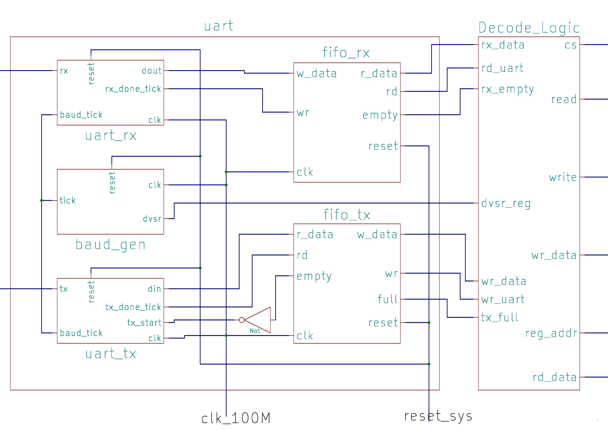
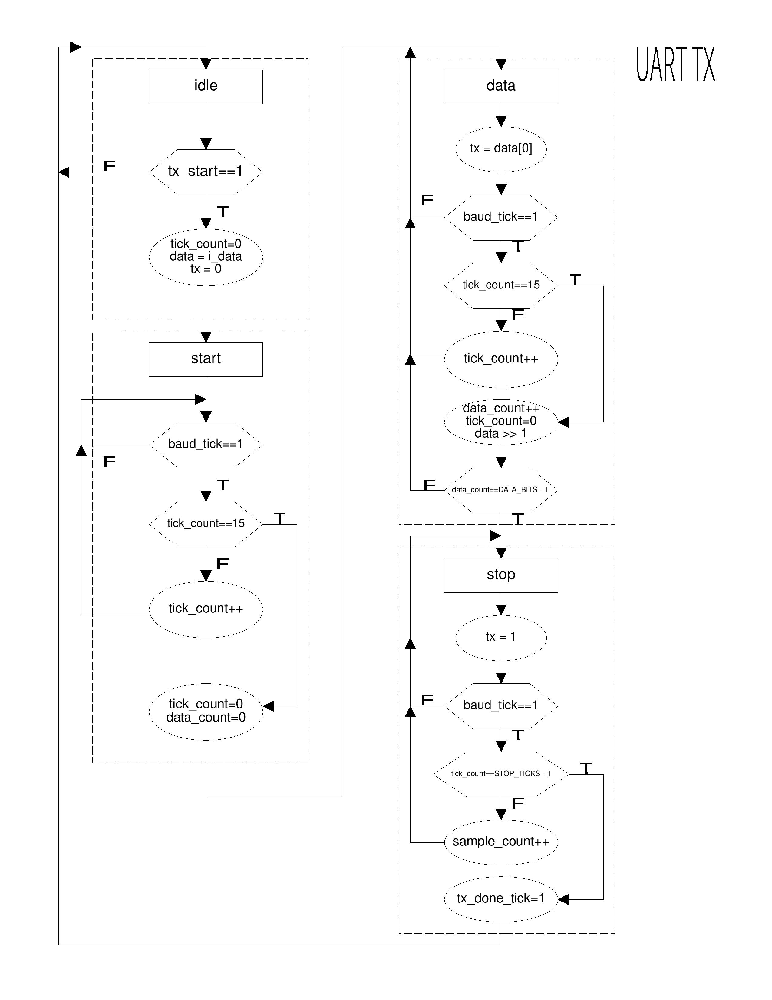

# Serial-Communication-SoC
- SoC using the Microblaze MCS designed for using different serial communication methods. The SoC contains a UART core, a SPI core, and an I2C core
- The SoC has 64 slots available for cores
- Each core contains 32 32-bit registers

# Directory Structure
<pre>
├── Diagrams
│   ├── i2c_fsm.jpg
│   ├── i2c_timing.jpg
│   ├── mmio.jpg
│   ├── soc_top.jpg
│   ├── spi.jpg
│   ├── uart.jpg
│   ├── uart_rx.jpg
│   └── uart_tx.jpg
├── Hardware
│   ├── MMIO
│   │   ├── Cores
│   │   │   ├── GPIO
│   │   │   │   ├── gpi.sv
│   │   │   │   └── gpo.sv
│   │   │   ├── I2C
│   │   │   │   ├── i2c_core.sv
│   │   │   │   └── i2c_master.sv
│   │   │   ├── SPI
│   │   │   │   ├── spi_core.sv
│   │   │   │   └── spi.sv
│   │   │   ├── Timer
│   │   │   │   └── timer.sv
│   │   │   └── UART
│   │   │       ├── baud_gen.sv
│   │   │       ├── FIFO
│   │   │       │   ├── fifo_ctrl.sv
│   │   │       │   ├── fifo.sv
│   │   │       │   └── reg_file.sv
│   │   │       ├── uart_core.sv
│   │   │       ├── uart_rx.sv
│   │   │       ├── uart.sv
│   │   │       └── uart_tx.sv
│   │   ├── mmio_controller.sv
│   │   └── mmio_top.sv
│   └── System
│       ├── io_map.svh
│       ├── soc_top.sv
│       └── sys_bridge.sv
├── README.md
└── Software
    ├── Applications
    │   └── main.cpp
    ├── Drivers
    │   ├── GPIO
    │   │   ├── gpio_core.cpp
    │   │   └── gpio_core.h
    │   ├── I2C
    │   │   ├── i2c_core.cpp
    │   │   └── i2c_core.h
    │   ├── SPI
    │   │   ├── spi_core.cpp
    │   │   └── spi_core.h
    │   ├── TIMER
    │   │   ├── timer_core.cpp
    │   │   └── timer_core.h
    │   └── UART
    │       ├── uart_core.cpp
    │       └── uart_core.h
    └── SystemFiles
        ├── init.cpp
        ├── init.h
        ├── io_map.h
        └── io_rw.h

</pre>

# System

- The soc_top.sv file instantiates and connects the Microblaze MCS, the system bridge, and the MMIO unit
- The sys_bridge.sv file handles the communication between the Microblaze MCS and the MMIO unit
    - The Microblaze MCS sends a 32-bit address to the system bridge. Bits 24-31 are used to determine if the address contains correct bridge base address. Bit 23 is used as the chip select signal for the MMIO subsystem (it should be 0). Bits 2-22 are used as the 21-bit address sent to the MMIO system. 
    - The read and write signals, as well as the read and write data, are passed directly through the bridge
- The io_map.svh file contains the mapping for the slots in the MMIO system.

# MMIO

- The memory mapped I/O system (MMIO) contains all the cores as well as a controller 
- The register address is contained in bits 0 to 4
- The slot address is contained in bits 5 to 10
- MMIO Controller
    - The MMIO controller handles the communication between the system bus and the MMIO cores. 
    - The controller takes the 21-bit address from the system bus and decodes it into the slot address and the register address.

## Timer Core
- A core for controlling timing
- Processor Interaction:
	- read 48-bit counter value
	- write the "go" signal to pause or resume counting
	- clear counter
- Register Map:
	- offset 0 (Read register):
		-  bits[31:0]: lower word of counter
	- offset 1 (Read register): 
		- bits[15:0]: 16 MSBs of counter 
	- offset 2 (Write register): 
		- bit 0: go signal
		- bit 1: clear signal

## GPI Core
- A general purpose input that receives the input from the switches on the FPGA

## GPO Core
- A general purpose output that transmits data to the leds on the FPGA

## UART

- Processor interaction:
	- Read 8-bit data
	- Write 11-bit divisor value
	- Write 8-bit data
- Register Map:
	- offset 0 (Read register):
		- bits \[7:0]: read data (received bits)
		- bit 8: empty signal from fifo_rx
		- bit 9: full signal from fifo_tx
		- bits \[31:10]: Unused (set to 0)
	- offset 1 (Write register):
		- bits\[10:0]: Divisor value
		- bits\[31:11]: unused
	- offset 2 (Write register):
		- bits\[7:0]: write data (bits to be transmitted)
		- bits\[31:8]: unused

## I2C Core
- Master I2C core
- Register Map:
    - Offset 0 (Read Register):
        - bit[0]: rx acknowledge bit
        - bits[8:1]: rx data
		- bit[9]: ready signal
    - offset 1 (Write register):
		- bits[15:0]: divisor
	- offset 2 (Write register):
		- bit[7:0]: tx_data
		- bits[10:8]: command
Explain hierarchy of system 
Go down the hierarchy explaining everything (soc_top, system bridge, mmio unit, the timer core, the gpo core, the gpi core, the uart core, the spi core, the i2c core) 
